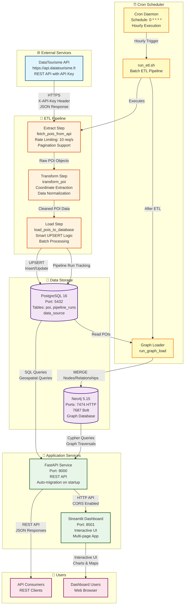

# Architecture Diagram

## Holiday Itinerary Data Engineering Project

This document contains the architecture diagram in Mermaid format. You can render it in:
- GitHub/GitLab (native Mermaid support)
- VS Code with Mermaid extension
- Online: https://mermaid.live
- Convert to PNG using: `mmdc -i architecture.mmd -o architecture.png` (requires mermaid-cli)

## System Architecture



## Data Flow

1. **Extraction**: Cron Scheduler triggers ETL pipeline hourly
2. **ETL Pipeline**: 
   - Extracts POI data from DataTourisme API
   - Transforms and normalizes data
   - Loads into PostgreSQL with UPSERT logic
3. **Graph Loading**: After ETL, loads POIs from PostgreSQL into Neo4j
4. **API Services**: FastAPI reads from both PostgreSQL and Neo4j
5. **Dashboard**: Streamlit dashboard consumes FastAPI endpoints
6. **Users**: Access via REST API or Web Dashboard

## Component Details

### External Services
- **DataTourisme API**: French tourism data platform
  - Rate Limits: 10 req/s sustained, ≤1000 req/hour
  - Authentication: API Key via X-API-Key header

### ETL Pipeline
- **Extract**: `src/pipelines/batch_etl.py::fetch_pois_from_api()`
- **Transform**: `src/pipelines/batch_etl.py::transform_poi()`
- **Load**: `src/pipelines/batch_etl.py::load_pois_to_database()`

### Cron Scheduler
- **Schedule**: Every hour at minute 0 (`0 * * * *`)
- **Script**: `docker/cron/crontab` → `/app/run_etl.sh`
- **Execution**: Batch ETL → Graph Loader

### Data Storage
- **PostgreSQL**: Relational database for POI data
- **Neo4j**: Graph database for relationship queries

### Application Services
- **FastAPI**: REST API with auto-migration
- **Streamlit**: Interactive dashboard with multiple pages

## Generating PNG from Mermaid

### Option 1: Using mermaid-cli
```bash
npm install -g @mermaid-js/mermaid-cli
mmdc -i docs/architecture/architecture.mmd -o docs/architecture/architecture.png
```

### Option 2: Using Online Tool
1. Visit https://mermaid.live
2. Paste contents of `architecture.mmd`
3. Click "Download PNG"

### Option 3: Using VS Code
1. Install "Markdown Preview Mermaid Support" extension
2. Open `architecture.md`
3. Right-click diagram → "Export as PNG"

